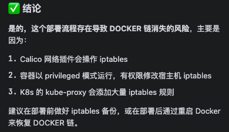

# 同一服务器部署应用与CI/CD流水线的网络冲突问题解决

## 背景

在企业的开发运维实践中，出于成本考虑，往往会将应用服务和CI/CD流水线部署在同一台服务器上。本文记录了一次在已有Docker环境中搭建GitLab + K8s + KubeSphere的CI/CD流水线时，引发全服务瘫痪的问题排查与解决过程。

## 环境信息

- 操作系统：Linux服务器
- 容器运行时：Docker
- CI/CD组件：GitLab + K8s + KubeSphere
- 部署工具：KubeKey

## 问题描述

### 问题现象

在已有Docker环境中执行KubeKey验证命令后：

```bash
kk create cluster -f config-sample.yaml
```

同一Docker环境下的所有应用程序全部瘫痪。尝试使用 `docker compose` 重启服务时，报错如下：

```
Error response from daemon: failed to set up container networking: driver failed programming external connectivity on endpoint fantomfite-admin (c5cf85c6a56ed52472c55953d7f2f1ff0887279070928f604b964d7da912a152): Unable to enable DNAT rule: (iptables failed: iptables --wait -t nat -A DOCKER -p tcp -d 0/0 --dport 8888 -j DNAT --to-destination 172.18.0.2:8888 ! -i br-78dc566ee864: iptables: No chain/target/match by that name.)
```

### 错误分析

核心错误信息：

```
iptables: No chain/target/match by that name
```

**问题本质**：Docker 在 iptables 的 NAT 表中需要的 `DOCKER` 链不存在了。

## 问题原因

经过排查分析，发现问题根源在于 KubeKey 的网络插件 **Calico**。


### Calico 与 Docker 的冲突

| 组件 | iptables 操作 | 影响 |
|------|---------------|------|
| Docker | 创建并维护 DOCKER 链用于容器网络 NAT | 容器端口映射依赖此链 |
| Calico | 可能重建 iptables 规则 | 可能删除非自身创建的链 |

Calico 作为 K8s 的网络插件，拥有修改 iptables 规则的权限。在某些情况下，它可能会对 iptables 规则进行重建，从而删除了 Docker 依赖的 `DOCKER` 链。

> **注意**：这个问题并非必然发生，取决于 Calico 的版本和配置。在某些环境下可能正常运行，但在特定条件下会触发此问题。

## 解决方案探索

针对这个问题，我进行了以下思路探索：

### 方案一：限制 Calico 不删除 Docker 链

**思路**：通过配置 Calico，限制其对 iptables 规则的修改范围。

**问题**：
- 配置复杂，需要深入了解 Calico 的 iptables 管理机制
- 可能影响 Calico 的正常功能
- 版本兼容性问题

### 方案二：监听并修复 Docker 链

**思路**：编写脚本监听 iptables 变化，自动修复 DOCKER 链。

**问题**：
- 治标不治本
- 增加运维复杂度
- 可能存在修复延迟导致的服务中断

### 方案三：嵌套容器（DinD）方案

**思路**：在 Docker 中运行 Docker（Docker in Docker）。

**问题**：
- 安全性风险较高
- 性能损耗大
- 不推荐用于生产环境

### 方案四：双 Docker 实例

**思路**：在同一台物理机上运行两个独立的 Docker 实例。

**问题**：
- 资源竞争
- 管理复杂
- 端口冲突风险

### 方案五：使用 Podman 替代 Docker

**思路**：使用 Podman 作为应用容器运行时，与 K8s 环境隔离。

**优势**：
- Podman 无守护进程，不依赖 iptables 链
- 与 Docker 命令兼容
- 可与 K8s 共存

## 最终方案：Podman 替代 Docker

综合考虑后，采用 Podman 替代 Docker 作为应用容器运行时。

### Podman 简介

Podman 是一个无守护进程的容器引擎，具有以下特点：

| 特性 | Docker | Podman |
|------|--------|--------|
| 架构 | C/S 架构，依赖守护进程 | 无守护进程 |
| Root 权限 | 需要 root 权限运行守护进程 | 支持 rootless 模式 |
| iptables 依赖 | 强依赖，维护 DOCKER 链 | 不依赖特定 iptables 链 |
| 命令兼容性 | - | 与 Docker 命令高度兼容 |

### 安装 Podman

```bash
# Ubuntu/Debian
sudo apt update
sudo apt install -y podman

# CentOS/RHEL
sudo yum install -y podman

# 验证安装
podman --version
```

### 迁移 Docker Compose 到 Podman

Podman 支持 Docker Compose 格式，可以直接使用：

```bash
# 方式一：使用 podman-compose
pip install podman-compose
podman-compose up -d

# 方式二：Podman 原生支持 compose（Podman 4.0+）
podman compose up -d
```

### 常用命令对照

| Docker 命令 | Podman 命令 |
|-------------|-------------|
| docker ps | podman ps |
| docker images | podman images |
| docker run | podman run |
| docker build | podman build |
| docker-compose up | podman-compose up |
| docker logs | podman logs |

## 最佳实践

### 1. 架构规划

在同一服务器部署应用和 CI/CD 时，建议：

- **生产环境**：应用服务与 CI/CD 基础设施分离部署
- **测试/开发环境**：可合并部署，但注意容器运行时选择

### 2. 容器运行时选择

| 场景 | 推荐方案 |
|------|----------|
| 纯应用部署 | Docker |
| 应用 + K8s 共存 | Podman |
| K8s 集群节点 | Containerd |

### 3. 网络隔离

如果必须使用 Docker 与 K8s 共存：

- 使用不同的网络命名空间
- 配置 Calico 使用独立的 iptables 链前缀
- 定期备份 iptables 规则

### 4. 监控告警

```bash
# 监控 Docker 网络状态
watch -n 5 'iptables -t nat -L DOCKER 2>/dev/null || echo "DOCKER chain missing!"'
```

### 5. 故障恢复脚本

```bash
#!/bin/bash
# 重启 Docker 服务以重建 iptables 链
systemctl restart docker

# 重启容器
docker compose up -d
```

## 总结

本文记录了一次 CI/CD 流水线搭建过程中遇到的容器网络冲突问题。问题根源在于 K8s 网络插件 Calico 与 Docker 的 iptables 规则冲突。通过分析多种解决方案的利弊，最终选择使用 Podman 替代 Docker 作为应用容器运行时，实现了应用服务与 K8s 环境的和谐共存。

**关键经验**：
1. 在同一服务器部署多种容器化基础设施时，需提前评估网络组件的兼容性
2. iptables 是容器网络的核心，任何对它的修改都可能影响容器通信
3. Podman 作为 Docker 的替代方案，在特定场景下具有独特优势

## 参考资料

- [Podman 官方文档](https://podman.io/docs)
- [Calico 网络插件文档](https://docs.tigera.io/calico/latest/about/)
- [Docker iptables 规则说明](https://docs.docker.com/network/iptables/)
- [KubeKey 部署文档](https://github.com/kubesphere/kubekey)
