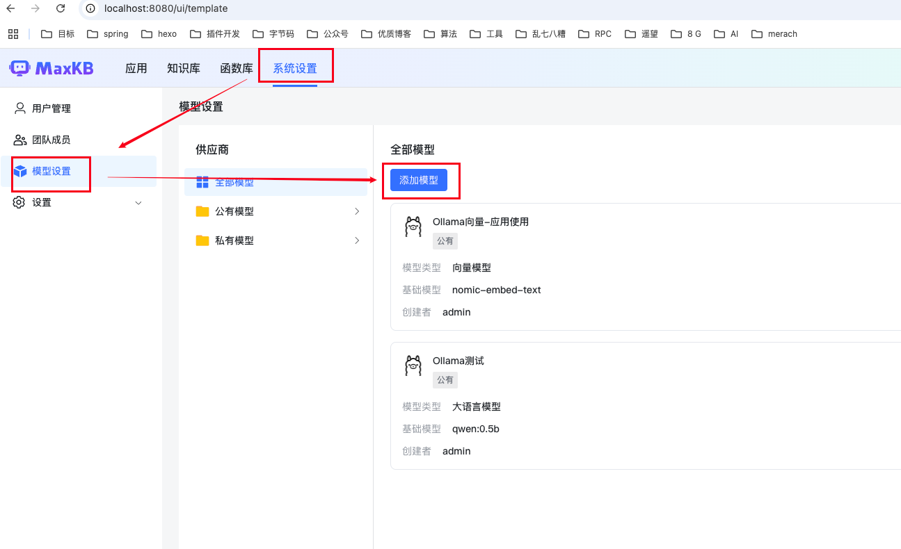
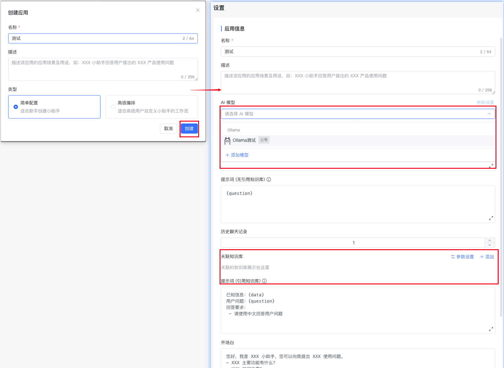

# 安装MaxKB

MaxKB是基于大语言模型的企业级智能问答知识库。这里推荐使用docker安装。

默认访问是8080，这里可以指定访问端口

```shell
docker run -d --name=maxkb --restart=always -p 8080:8080 -v ~/.maxkb:/var/lib/postgresql/data -v ~/.python-packages:/opt/maxkb/app/sandbox/python-packages 1panel/maxkb
```

安装完以后打开 `localhost:8080`

# 登录

> 默认登录账号为admin，密码： MaxKB@123..

首次登录建议修改密码。

# 配置模型

访问路径： 系统设置-模型设置-添加模型



模型这里选择的是`Ollama`的`qwen:0.5b`的小模型,模型大小根据电脑配置自己决定。

`Ollama`去 [官网](https://ollama.com/download) 自行安装，不知道下什么模型的可以去`Ollama`提供的 [模型库](https://ollama.com/search) 查看。

## 安装 Ollama

安装完成后运行 `ollama serve`，打开`http://localhost:11434/`显示如下说明安装成功

```
Ollama is running
```

### 下载模型

这里下载的是`qwen:0.5b`

`ollama pull qwen:0.5b`

接下来可以`添加模型`了

1. 选择供应商
    
2. 填写基础信息。
   > 模型这里可以选择向量模型或者大语言模型
   > 
   > 这里`API URL`如果是本机地址，则填写 `host.docker.internal:11434`. 
   > 
   > `11434`是`ollama`的默认访问端口。
   > 
   > `ollama`不需要`API KEY`，可以随便填。
   > 
   > 最后点保存
   > 
    
   
# 添加知识库
1. 入口： 知识库 - 创建知识库

填写知识库名称+选择之前创建的`向量模型`后点创建，进入下一页。

2. 点击上传文件


# 配置应用
* 点创建应用


* 填写创建的模型和知识库

  
# 访问应用
* 应用创建完后，点击生成的公开链接。开始体验吧

  
