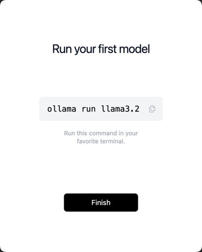

## 概述
本地安装Ollama并添加大模型，支持Chat API本地调用

## 环境
mac、m1

## 安装Ollama
1. 打开github上的地址： https://github.com/ollama/ollama
2. 根据系统选择合适的下载包下载，本例是macos，所以下载后的包是 Ollama-darwin.zip
3. 将安装包解压 `unzip Ollama-darwin.zip`
4. 打开后里面就躺着一个 `Ollama.app`,打开
   
    
5. 按提示进行，最后点击`finish`
   
    
   
## 安装大模型
这里可以选择官方提供的几种模型，https://ollama.com/library

这里根据参数大小，可以有多种size进行选择，模型的特性也不一样，按需选择


执行命令，这里选择的是安装默认的大模型。`ollama run llama3.2`

## 安装完成&验证
```shell
jianyingcai@JianyingdeMacBook-Pro-2 ollama % ollama run llama3.2
pulling manifest 
pulling dde5aa3fc5ff... 100% ▕██████████████████████████████████████████████████████████████████████████████████████████████████████████████████████████████████████████████████████████████████████████████████████████████████████████████████████████████████████████████████████████████████████████████████████████████▏ 2.0 GB                         
pulling 966de95ca8a6... 100% ▕██████████████████████████████████████████████████████████████████████████████████████████████████████████████████████████████████████████████████████████████████████████████████████████████████████████████████████████████████████████████████████████████████████████████████████████████▏ 1.4 KB                         
pulling fcc5a6bec9da... 100% ▕██████████████████████████████████████████████████████████████████████████████████████████████████████████████████████████████████████████████████████████████████████████████████████████████████████████████████████████████████████████████████████████████████████████████████████████████▏ 7.7 KB                         
pulling a70ff7e570d9... 100% ▕██████████████████████████████████████████████████████████████████████████████████████████████████████████████████████████████████████████████████████████████████████████████████████████████████████████████████████████████████████████████████████████████████████████████████████████████▏ 6.0 KB                         
pulling 56bb8bd477a5... 100% ▕██████████████████████████████████████████████████████████████████████████████████████████████████████████████████████████████████████████████████████████████████████████████████████████████████████████████████████████████████████████████████████████████████████████████████████████████▏   96 B                         
pulling 34bb5ab01051... 100% ▕██████████████████████████████████████████████████████████████████████████████████████████████████████████████████████████████████████████████████████████████████████████████████████████████████████████████████████████████████████████████████████████████████████████████████████████████▏  561 B                         
verifying sha256 digest 
writing manifest 
success 
>>> Send a message (/? for help)
```

### 对话 & API
对话
```shell
>>> 你好
您好！是非常高兴与您交流的机会。请说一下您需要帮助什么？
```

API
> 默认是采用stream方式交互的，这里测试可以改成false
```shell
jianyingcai@JianyingdeMacBook-Pro-2 ollama % curl http://localhost:11434/api/chat -d '{
  "model": "llama3.2",
  "messages": [
    { "role": "user", "content": "Hello" }
  ], 
  "stream": false
}'
{"model":"llama3.2","created_at":"2024-12-30T09:41:01.844715Z","message":{"role":"assistant","content":"Hello! How can I assist you today?"},"done_reason":"stop","done":true,"total_duration":1924742542,"load_duration":44130875,"prompt_eval_count":26,"prompt_eval_duration":1501000000,"eval_count":10,"eval_duration":377000000}% 

```
