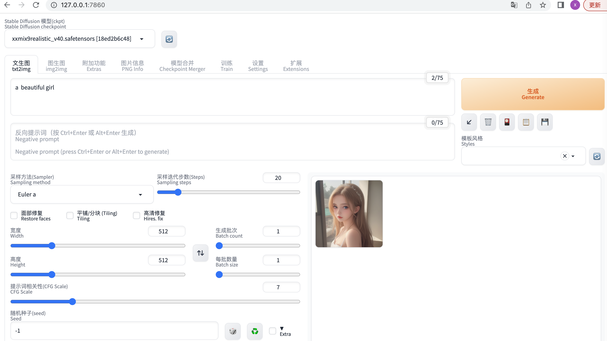

## 前言
闲暇时，整了下`stable diffusion webui`，玩了玩AI绘画。是不是看着还有点意思呢？那就继续往下看吧。

## 环境
mac、m1

## 安装
其实安装起来不难，网速慢的话，一天左右也能搞定。把项目down下来后，根目录下启动`./webui.sh`。遇到问题解决问题，然后重启，循环往复，直到出现`Running on local URL:  http://127.0.0.1:7860`这句话为止。
* 认准github地址：https://github.com/AUTOMATIC1111/stable-diffusion-webui
* 模型文件默认存放目录：`/Users/xxx/stable-diffusion-webui/models/Stable-diffusion`

## 问题
1. Warning: caught exception 'Torch not compiled with CUDA enabled', memory monitor disabled

mac电脑上会看到这个`warning`，不解决的话会引发其他问题。启动命令调整为：`./webui.sh --precision full --no-half`

## 资料
汉化版教程：https://zhuanlan.zhihu.com/p/620316199

模型下载网站（需要科学上网😆）：https://civitai.com/ https://huggingface.co/models

