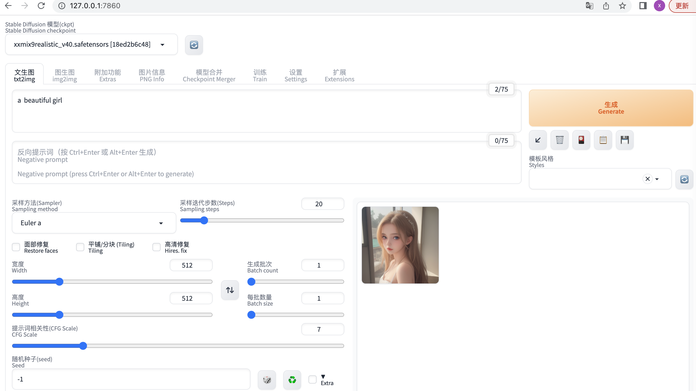

## 前言
闲暇时，整了下`stable diffusion webui`，玩了玩AI绘画。是不是看着还有点意思呢？那就往下看吧。



## 环境
mac、m1

## 安装
其实安装起来不难，网速慢的话，一天左右也能搞定。把项目down下来后，根目录下启动`./webui.sh`。遇到问题解决问题，然后重启，循环往复，直到出现`Running on local URL:  http://127.0.0.1:7860`这句话为止。
* 认准github地址：https://github.com/AUTOMATIC1111/stable-diffusion-webui
* 模型文件默认存放目录：`/Users/xxx/stable-diffusion-webui/models/Stable-diffusion`

## 问题
1. Warning: caught exception 'Torch not compiled with CUDA enabled', memory monitor disabled

    mac电脑上会看到这个`warning`，不解决的话会引发其他问题。启动命令调整为：`./webui.sh --precision full --no-half`

2. RuntimeError: Couldn't install torch.
```shell
Installing torch and torchvision
WARNING: Retrying (Retry(total=4, connect=None, read=None, redirect=None, status=None)) after connection broken by 'SSLError(SSLCertVerificationError(1, '[SSL: CERTIFICATE_VERIFY_FAILED] certificate verify failed: unable to get local issuer certificate (_ssl.c:1007)'))': /simple/torch/
WARNING: Retrying (Retry(total=3, connect=None, read=None, redirect=None, status=None)) after connection broken by 'SSLError(SSLCertVerificationError(1, '[SSL: CERTIFICATE_VERIFY_FAILED] certificate verify failed: unable to get local issuer certificate (_ssl.c:1007)'))': /simple/torch/
WARNING: Retrying (Retry(total=2, connect=None, read=None, redirect=None, status=None)) after connection broken by 'SSLError(SSLCertVerificationError(1, '[SSL: CERTIFICATE_VERIFY_FAILED] certificate verify failed: unable to get local issuer certificate (_ssl.c:1007)'))': /simple/torch/
WARNING: Retrying (Retry(total=1, connect=None, read=None, redirect=None, status=None)) after connection broken by 'SSLError(SSLCertVerificationError(1, '[SSL: CERTIFICATE_VERIFY_FAILED] certificate verify failed: unable to get local issuer certificate (_ssl.c:1007)'))': /simple/torch/
WARNING: Retrying (Retry(total=0, connect=None, read=None, redirect=None, status=None)) after connection broken by 'SSLError(SSLCertVerificationError(1, '[SSL: CERTIFICATE_VERIFY_FAILED] certificate verify failed: unable to get local issuer certificate (_ssl.c:1007)'))': /simple/torch/
Could not fetch URL https://pypi.org/simple/torch/: There was a problem confirming the ssl certificate: HTTPSConnectionPool(host='pypi.org', port=443): Max retries exceeded with url: /simple/torch/ (Caused by SSLError(SSLCertVerificationError(1, '[SSL: CERTIFICATE_VERIFY_FAILED] certificate verify failed: unable to get local issuer certificate (_ssl.c:1007)'))) - skipping
ERROR: Could not find a version that satisfies the requirement torch==2.3.1 (from versions: none)
ERROR: No matching distribution found for torch==2.3.1
Traceback (most recent call last):
  File "/Users/jianyingcai/stable-diffusion-webui/launch.py", line 48, in <module>
    main()
  File "/Users/jianyingcai/stable-diffusion-webui/launch.py", line 39, in main
    prepare_environment()
  File "/Users/jianyingcai/stable-diffusion-webui/modules/launch_utils.py", line 381, in prepare_environment
    run(f'"{python}" -m {torch_command}', "Installing torch and torchvision", "Couldn't install torch", live=True)
  File "/Users/jianyingcai/stable-diffusion-webui/modules/launch_utils.py", line 116, in run
    raise RuntimeError("\n".join(error_bits))
RuntimeError: Couldn't install torch.
Command: "/Users/jianyingcai/stable-diffusion-webui/venv/bin/python" -m pip install torch==2.3.1 torchvision==0.18.1
Error code: 1
```
以上错误是因为，本地Python环境是Python3命令，不支持python命令，因此需要将python映射到python3命令上

    1. 更新软链接（Linux/macOS）
    ```shell
    sudo ln -sf $(which python3) /usr/local/bin/python
    ```
    
    2. 永久修改 PATH 变量  
    编辑 ~/.bashrc 或 ~/.zshrc（根据您使用的终端）：
    ```shell
    export PATH=$(dirname $(which python3)):$PATH
    ```
    3. 更新环境
    ```shell
    source ~/.bashrc  # 或 source ~/.zshrc
    ```

## 资料
汉化版教程：https://zhuanlan.zhihu.com/p/620316199

模型下载网站（需要科学上网😆）：https://civitai.com/ https://huggingface.co/models


