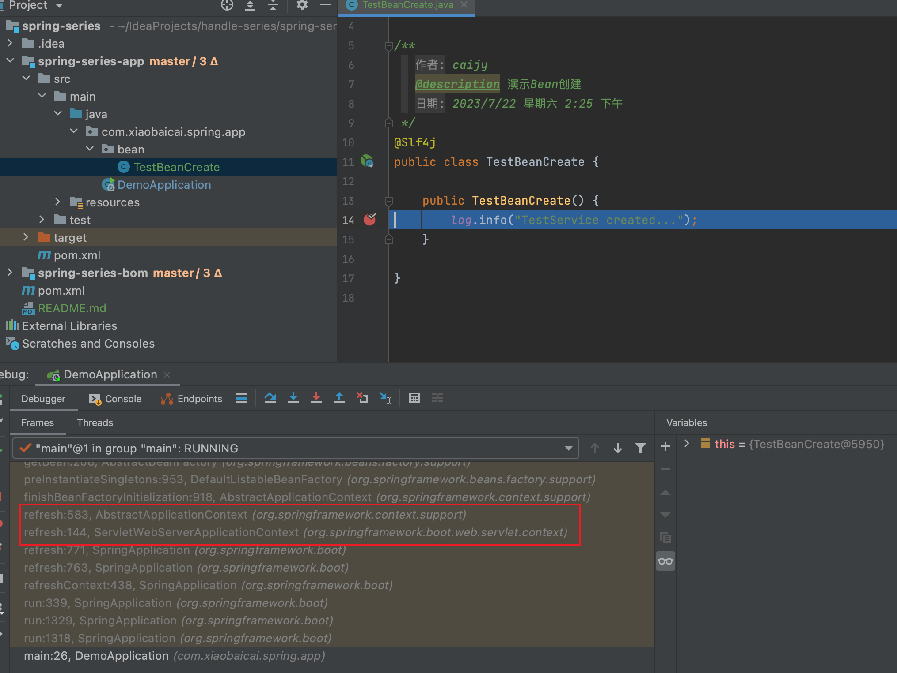
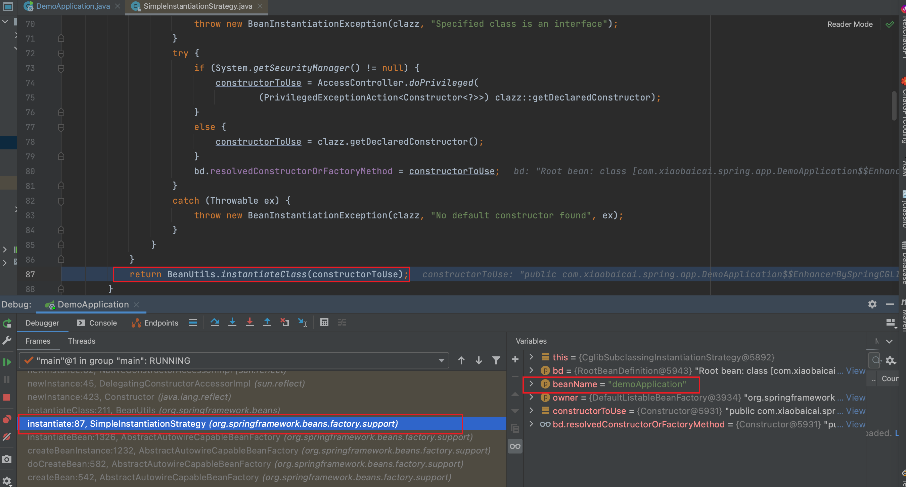
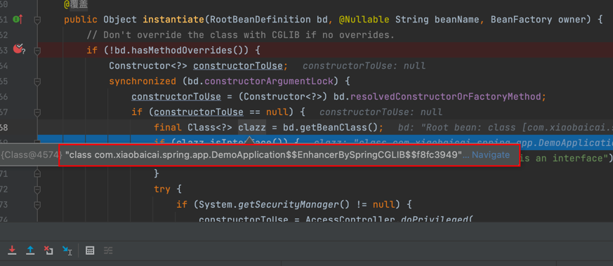
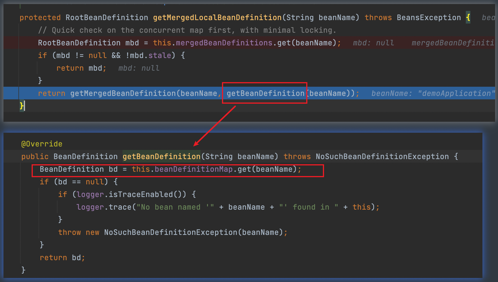
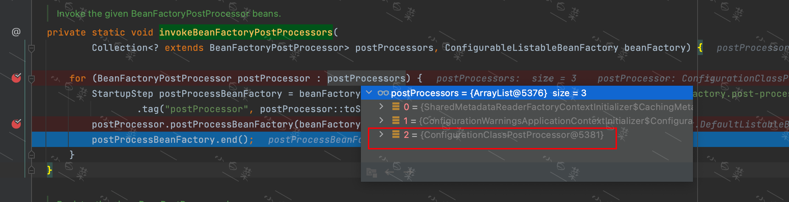

>要知道SpringBean的生命周期，我们首先要从**SpringBean是如何创建的**这个问题入手，反推SpringBean的生命周期。

## Spring容器的Bean是如何创建的
首先看我们用`@Bean`注解配置的这个类。
> 众所周知，一个Bean被创建必然会调用其构造方法，我们把断点打在构造方法处，然后启动项目。

**由于全类名太长，这里省略了前面的包名。**通过调用栈，我们可以分析得到：
* SpringBoot经过一系列的处理，最后从`AbstractApplicationContext#refresh`方法入手，作为Spring的入口
* 通过`SimpleInstantiationStrategy#instantiate`中的`factoryMethod.invoke`去调用方法，
  `factoryMethod`是一个`java.lang.reflect.Method`类型，指向`DemoApplication.testBeanCreate`方法,很显然使用了反射的方式去调用方法

> 我们可以得出结论：Spring容器的Bean是通过反射调用`DemoApplication.testBeanCreate`方法创建的。

😂 但是仔细看这个方法，我们会发现，这个bean其实就是我们自己new出来的。
所以这种@Bean的方式，只是Spring把主动权交给我们，具体怎么创建是我们说了算。
那有没有一种方式是Spring自己主动创建bean的？对，`@Component`就是这种方式。
那么，被标记为`@Component`的Bean是怎么被Spring创建出来的呢？我们继续探究。

## 思考
>为什么我们前面说的`DemoApplication.testBeanCreate`方法是可以被Spring通过反射调用的？

那是因为`DemoApplication`这个对象已经被Spring实例化出来了。
为什么会被实例化出来呢？因为这个类含有`@Component`注解。
仔细看不难发现，`@SpringBootApplication`是一个复合注解，
里面包含了`@SpringBootConfiguration`，`@SpringBootConfiguration`又包含了`@Configuration`，而`@Configuration`包含了`@Component`。
嗯，那么接下来我们主要研究`DemoApplication`是怎么被创建出来的就行了。

我们为`DemoApplication`写一个构造方法，打上断点，再次启动项目。

通过调用栈，我们可以分析得到：
* Spring通过`SimpleInstantiationStrategy#instantiate(RootBeanDefinition, String, BeanFactory)`这个方法去实例化类对象。
  针对咱们这个例子，就是拿到这个类的构造方法，通过构造方法`ctor.newInstance`反射去new这个对象。

既然是用反射去创建，那为什么不一开始就用反射去创建Bean呢？
显然我们只知道Spring的Bean是通过反射创建的是不够的，Spring作为一个优秀的框架从设计上会从性能、扩展性、可维护性等维度综合考虑。

言归正传，我们debug`SimpleInstantiationStrategy#instantiate(RootBeanDefinition, String, BeanFactory)`这个方法时会发现，这个构造方法来源于一个代理对象

那么问题来了。
1. 实例化的时候，`BeanDefinition`是怎么来的?
2. `BeanDefinition`里面的`beanClass`属性值为什么会是一个Cglib的代理对象?
## 思考
> 实例化的时候，`BeanDefinition`是怎么来的

我们循着这个实例化的方法往上找，最终会定位到`AbstractBeanFactory#doGetBean`的`RootBeanDefinition mbd = getMergedLocalBeanDefinition(beanName);`。
这个方法会把父bd和子bd做合并，并返回最顶层的bd。
所谓的合并，就是存放类和它的`RootBeanDefinition`的关系，在`mergedBeanDefinitions<String,RootBeanDefinition>`中。
而它最终就是从`beanDefinitionMap`中通过`beanName`找这个类的`BeanDefinition`的。

而这个`beanDefinitionMap`就是在容器`refresh`之前，SpringBoot通过方法`BeanDefinitionLoader#load(java.lang.Class<?>)`将启动类`demoApplication`手动注册的。
对于使用`@Bean`方式配置的类，会把当前类中使用`@Bean`标注的方法找出来，一一放入`beanDefinitionMap`中。
对于使用`@Component`方式配置的类,Spring会使用包扫描机制寻找并解析这些类。这里就不展开说了。

## 思考
> `BeanDefinition`里面的`beanClass`属性值为什么会是一个Cglib的代理对象?

在某次调用getMergedLocalBeanDefinition(beanName)这个方法的时候，发现beanDefinitionMap的value由全类名变成了CGLIB的代理对象！
后来多次调试发现，`PostProcessorRegistrationDelegate#invokeBeanFactoryPostProcessors(java.util.Collection<? extends BeanFactoryPostProcessor>, ConfigurableListableBeanFactory)`
这个方法执行完后，会将原本的beanClass修改为CGLIB的代理对象。
继续缩小范围，最后找到了是这个处理器在捣鬼,这个必须要全名啊：`org.springframework.context.annotation.ConfigurationClassPostProcessor`！
[这篇文章将会详细介绍ConfigurationClassPostProcessor](/md/source_code/spring/后置处理器/ConfigurationClassPostProcessor/ConfigurationClassPostProcessor.md)

从这个名字上看，这是一个专门处理配置类的`BeanFactoryPostProcessor`，它在`postProcessBeanFactory`方法中将原有全类名替换为CGLIB增强后的代理类。
Spring会将由`@Configuration`修饰的类优先处理。
    
根据以上我们对`@Bean`和`@Configuration`两种注解的bean的调试，Bean的创建过程可以归纳为
* 注册BeanDefinition => 判断是否要对`BeanDefinition`进行增强，若有则增强 => 调用容器方法`AbstractBeanFactory#doGetBean`以反射的方式创建Bean

这是不是很简单，当然这个只是Bean创建的前因后果，并不是一个完整的生命周期。下一篇将继续破解Spring Bean的生命周期

