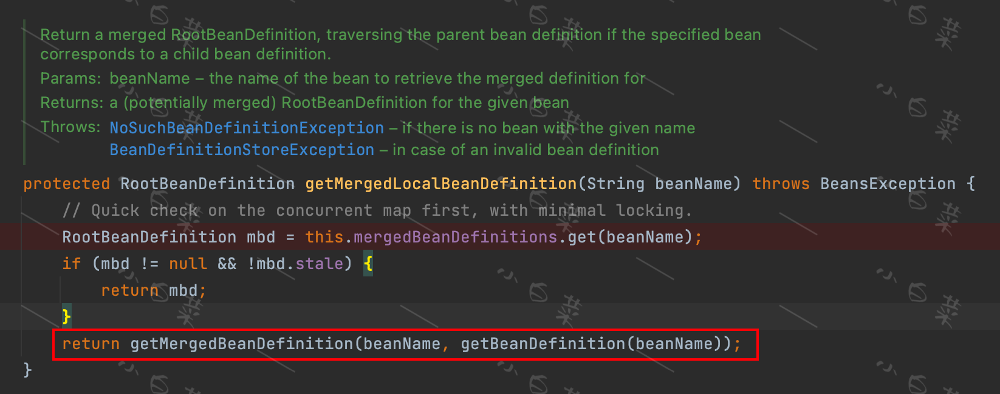

上文曾多次提到刷新容器的入口方法`AbstractApplicationContext#refresh`，
`AbstractApplicationContext`是一个十分重要的类，
它通过实现`org.springframework.context.ConfigurableApplicationContext`来提供容器上下文的通用配置。
因此几乎所有的Spring容器类都会去继承`AbstractApplicationContext`，从而快速具备Spring容器的一些通用操作。
而`refresh`就是对容器的通用操作之一，是刷新容器上下文的意思，
用于加载或刷新配置信息，比如XML方式、基于Java配置的方式、properties文件的方式等。

>执行完**注册BeanDefinition**后，大多数Spring容器类都会去调用`refresh`方法完成**容器的自动刷新**。

接下来我们来细看`refresh`中的主要实现步骤。

⏰ 注意：基于SpringBoot的演示项目，源码中有些判断下的方法并不会执行，这里只梳理出通常情况下执行的方法

## prepareRefresh
执行上下文的前置准备，包括记录开始时间和激活关闭标志以及属性资源的初始化

## obtainFreshBeanFactory
返回执行`refresh`操作的`ConfigurableListableBeanFactory`,这里是默认的实现类`DefaultListableBeanFactory`

## prepareBeanFactory
准备BeanFactory的标准上下文特性，比如类加载器和后置处理器。
1. 设置类加载器
2. 注册`ApplicationContextAwareProcessor`(是一个BeanPostProcessor)，用于aware回调。
3. 设置依赖接口忽略：`ignoreDependencyInterface`
4. 注册特殊的依赖类型，如`BeanFactory`、`ResourceLoader`、`ApplicationEventPublisher`、`ApplicationContext`
5. 注册`ApplicationListenerDetector`(是一个BeanPostProcessor)

## postProcessBeanFactory
请注意，这个方法并非什么都没做。
我们看它实际是它的子类在执行
 
从执行情况来看，虽然看似啥都没做，但是还是做了**扫包和手动注册**的判断逻辑的。

## invokeBeanFactoryPostProcessors
这一步包含了对`BeanDefinition`进行的增强，如前面说的[ConfigurationClassPostProcessor](/md/source_code/spring/后置处理器/ConfigurationClassPostProcessor/ConfigurationClassPostProcessor.md)对配置类的`BeanDefinition`进行CGLIB的增强。
其实就是，实例化并调用所有已注册的`BeanFactoryPostProcessors`，按给定的顺序或默认顺序执行。

1. 执行所有的`BeanDefinitionRegistryPostProcessor#postProcessBeanDefinitionRegistry`，
   执行优先级为：@PriorityOrdered > @Ordered > 其他
2. 执行所有的`BeanFactoryPostProcessor#postProcessBeanFactory`,执行优先级同上

## registerBeanPostProcessors
注册所有的`BeanPostProcessor`，这种类型的后置处理器会在Bean实例化前后做出拦截。

1. 找到所有`BeanPostProcessor`类型的实现类，注册顺序按照优先级分类：`@PriorityOrdered` > `@Ordered` > 其他非内部后置处理器 > 内部后置处理器。
2. 依次通过`ConfigurableBeanFactory#addBeanPostProcessor`或`AbstractBeanFactory#addBeanPostProcessors`对后置处理器进行注册。
2. 最后注册`ApplicationListenerDetector`，
   会检查`ApplicationListener`接口的bean是否可以通过`getBeanNamesForType`获取到，保证这种方式的可靠性
   
## initMessageSource
初始化国际化相关的资源

## initApplicationEventMulticaster
初始化事件多播器。默认使用`SimpleApplicationEventMulticaster`作为多播器

## onRefresh()
Spring提供的扩展方法，本身是空方法。用于在单例Bean实例化之前，初始化一些特殊的Bean。目前工作中暂无此场景，若大家有碰到此场景的话，欢迎[联系我](/md/guide/README)

## registerListeners
>Spring中运用了多种设计模式，这是观察者模式的一种体现

1. 为多播器添加早先指定好的`ApplicationListener`，比如SpringBoot的`SpringApplication#prepareContext`就会在容器Refresh之前注册指定的`ApplicationListener`。
2. 为多播器添加`ApplicationListener`的实现类
3. 使用多播器提前发布事件通知

## finishBeanFactoryInitialization
实例化所有非懒加载的实例bean。
我们直接看核心方法`beanFactory.preInstantiateSingletons();`的`AbstractBeanFactory#getBean(java.lang.String)`,
跟踪到`AbstractBeanFactory#doGetBean`

>**这里以`demoApplication`为例,跟着一步步调试**
> 1. **transformedBeanName(name) :** 转换Bean的名称，包括对FactoryBean的名称截取等。这里依旧是`demoApplication`
> 2. **getSingleton(beanName) :** 这里是第一次从单例池获取，返回为null
> 3. **markBeanAsCreated(beanName) :** 标记这个bean正在被创建
     1. 加入到`this.alreadyCreated`集合中
     2. 并且表示为可重新Merge定义(将`RootBeanDefinition.stale`改为`true`)
> 4. **getMergedLocalBeanDefinition(beanName) :** 此时会再走一遍这个方法。
> 
> 你多调试几次就会发现，这段代码的逻辑就是：
     > 除了第一次走了下面的`return getMergedBeanDefinition(beanName, getBeanDefinition(beanName));`，
     > 后面几次都会直接`return mbd`，直到执行完`markBeanAsCreated(beanName);`再次进来，**它会重新再merge一遍BeanDefinition**。
> 5. **checkMergedBeanDefinition(mbd, beanName, args) :** 校验合并后的结果
> 6. **getSingleton(String beanName, ObjectFactory<?> singletonFactory) :** 
     > 这个是`getSingleton`重载的一个方法，实现了真正的实例化过程。
     1. 从单例池拿，发现拿不到，于是乎👇
     2. `beforeSingletonCreation(beanName);`这个是对循环依赖的一个校验
     3. `singletonObject = singletonFactory.getObject();`这个方法是由一个lambda表达式触发的，相当于执行了`AbstractAutowireCapableBeanFactory#createBean`
         1. `resolveBeanClass(mbd, beanName)` , 解析BeanClass
         2. `resolveBeforeInstantiation(beanName, mbdToUse)`: 执行BeanPostProcessor的`postProcessBeforeInitialization`和`postProcessAfterInitialization`
         3. 真正的`doCreateBean`，这一步比较复杂。 [查看详解](/md/source_code/spring/Spring的骚操作/doCreateBean/createBean)
     4. `afterSingletonCreation(beanName);` ,去掉正在被创建的标识：`singletonsCurrentlyInCreation`
     5. `addSingleton(beanName, singletonObject);` 加入到单例池中
> 7. **getObjectForBeanInstance :** 拿到实例对象，主要包含对FactoryBean的对象获取

## finishRefresh
> 推送相应的事件

1. 清理上下文级的资源缓存
2. 初始化生命周期处理器,使用默认的处理器`DefaultLifecycleProcessor`
3. 发布最后的事件

