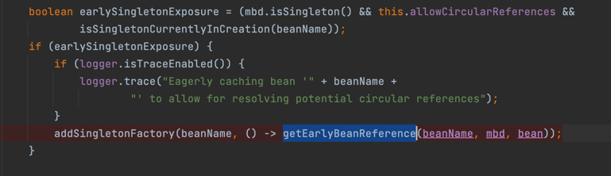
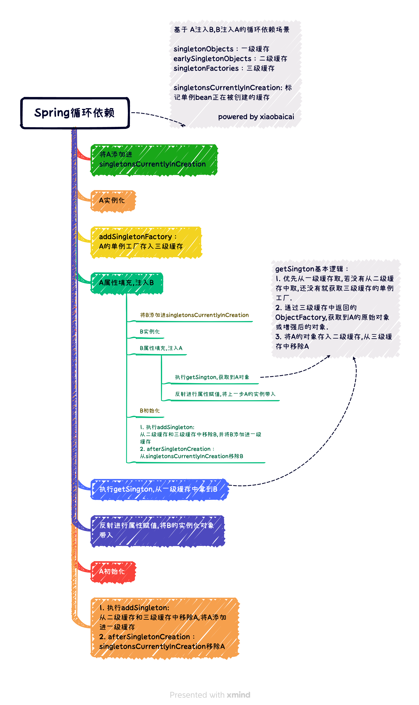

## 前言
这里需要有[Bean创建的具体过程](/md/source_code/spring/Spring的骚操作/doCreateBean/createBean.md)的前置知识储备，便于本节的理解。

## 背景
在源码调试的过程中，细心的同学会意识到，Spring对循环依赖做了特别处理。

那么什么是循环依赖呢？

### 什么是循环依赖
* 直接依赖方式：A依赖了B，B依赖了A
* 间接依赖方式：A依赖了B，B依赖了C，C依赖了A

循环依赖会导致什么问题呢？会使两个不完整的Bean共存，Spring也正是为了解决共存的问题。

考虑到调试逻辑要尽可能简单，所以选择直接依赖。

>⏰ 注意：本例探究的是 **单例模式下，通过field属性自动注入(setter方法注入)**的场景，这是Spring解决循环依赖的场景。
> 
> 另外有两种场景，Spring目前是无法解决的,只会抛出异常:
>   1. 通过构造器注入
>   2. 原型模式下，通过field属性自动注入

## 寻找入口
Spring在对循环依赖进行特别处理的时候，都会对代码进行注释。
通过之前阅读源码，不难找到以下方法
* `DefaultSingletonBeanRegistry#addSingletonFactory` 
* `DefaultSingletonBeanRegistry#getSingleton(java.lang.String, boolean)`

**在调试之前，先看一遍这两个方法。**

* `addSingletonFactory`
  这个方法告诉我们，这是一个添加单例工厂的方法。
    * 会把`ObjectFactory<?> singletonFactory`添加到**`singletonFactories`**中，继续跟进发现它是个map
    * 通过注释发现，它是三大缓存之一。分别为：
        > singletonObjects：一级缓存
          earlySingletonObjects：二级缓存
          singletonFactories：三级缓存
      
    别问我是怎么知道的😎（他仨的注释，就是这么像）
    
    * 进行属性填充之前，若**`this.allowCircularReferences`（允许循环依赖开关）**被打开，
      以及**当前这个单例Bean正在被创建**，那么就进行单例工厂的注册。
      
      循环依赖默认是打开的，而且单例Bean在创建之前都会做个标记正在创建中(具体可看`DefaultSingletonBeanRegistry#beforeSingletonCreation`)，
      所以`this.earlySingletonExposure`大部分情况下都是`true`
    
  
* `getSingleton(java.lang.String, boolean)`
   
   这个方法有多处调用，所以就先看看这个方法做了什么。其实解释起来，没想象中这么复杂。
  
   总结下来，就是从三级缓存中找到单例Bean。

   1. 先从单例池中获取实例
   2. 若单例池中没有，且当前这个Bean还在创建中，则从二级缓存获取提早生成的单例Bean。
   3. 若二级缓存没有，且允许提早引用，则拿到锁，再次从单例池中获取这个Bean。这是为了考虑到这个Bean可能会被其他线程创建。
   4. 若单例池还是没有，则再从二级缓存中获取单例Bean
   5. 若二级缓存还是没有，此时从三级缓存中拿到单例的工厂
   6. 若能拿到，则使用单例工厂创建或增强Bean，将这个Bean存入二级缓存，同时移除当前这个Bean的单例工厂

## 准备调试
> 演示项目下载位置：[前期准备](/md/source_code/spring/前期准备/前期准备)
>
> 可以重点看三个类：CircularBeanA、CircularBeanB、CircleReferenceTest
> 
> CircularBeanA即后面提到的A,CircularBeanB即后面提到的B

执行完测试类发现：A和B的方法都被调用了，说明Spring解决了循环依赖问题，符合预期

带着问题调试，是我们的宗旨。因为我们要断点，需要蛇打七寸。接下来看我的断点

前面阅读源码的时候，添加单例工厂这一步已经很明了，大多数单例Bean创建前都会存入三级缓存。
而本例的`CircularBeanA`、`CircularBeanB`也不例外，因为默认都符合添加单例工厂的判断条件，所以不用调试。

接下来就是看单例工厂是在什么时候被拿出来了。
因为例子中A会被先创建，属性填充B时创建B，然后在B中填充A......
A创建之前是有单例工厂存入三级缓存的，所以大概率是A的单例工厂先被使用。

## 开始调试
接下来启动测试类`CircleReferenceTest`，我们观察调用栈发现，是在属性注入的时候，需要拿到A的单例工厂。

点击`doCreateBean`的堆栈，可以看到正在创建B，说明创建B的过程中需要注入A。

接下来我们回到我们刚才打的断点，执行`singletonFactory.getObject()`。
这里用了`JDK 8`的**函数式接口**，真正调用的方法是，`getEarlyBeanReference`这个方法。

点击进去会发现，其实这个方法是对创建好的bean做aop的增强。

## 遇到问题

我们再次回到断点处，发现三级缓存也有B的单例工厂。那么问题来了，B的单例工厂会被用到吗？

按照我们的想法，B注入A的时候，会通过三级缓存拿到A的单例工厂，然后通过工厂去获取原始对象或者代理对象。而A注入B的时候，应该也会拿到B的单例工厂，拿它会执行工厂方法吗？

为了验证这个结论，我们修改断点，将A改为B，重新启动。

然后我们惊讶地发现，启动完很平静😦，断点竟然没走❗️❗️

**在循环依赖开关打开的情况下，几乎所有的bean都会被添加进三级缓存。但是，并不是所有的bean都会执行三级缓存中的单例工厂方法。**

好嘛，还是改回A吧，一步步看B填充完属性后，做了什么

又过了一会儿......有进展❗️❗️

## 新进展️❗️

我们跟踪到这个方法`org.springframework.beans.factory.support.DefaultSingletonBeanRegistry#getSingleton(java.lang.String, org.springframework.beans.factory.ObjectFactory<?>)`

发现B创建完后，执行了两个方法，从二、三级缓存中把这个B移除，同时加入了单例池，即一级缓存。

哦，破解了，确实是这里忽略了。

最后验证一下，A填充属性时，是否从单例池将B取出来注入！

1. 在`org.springframework.beans.factory.support.AbstractAutowireCapableBeanFactory#doCreateBean`的`populateBean`处,添加A的断点

2. 在 `org.springframework.beans.factory.support.DefaultSingletonBeanRegistry#getSingleton(java.lang.String, boolean)` 
   添加条件：`beanName.equals("circularBeanB") && singletonObject!=null`

>跑起来的时候，
> 
> 1. 断点会先到`populateBean(beanName, mbd, instanceWrapper);`，注意`beaName`此时是`circularBeanA`。
> 2. `populateBean`往下执行，会到`getSingleton`这个断点，注意这个方法会有很多地方都会调用到，只需要看方法栈从A的`populateBean`过来的
> 

## 最后
好了，最后晒上整理好的Spring循环依赖流程图！

## 相关资料
[小傅哥的爽文：《Spring Bean IOC、AOP 循环依赖解读》](https://bugstack.cn/md/java/interview/2021-05-05-%E9%9D%A2%E7%BB%8F%E6%89%8B%E5%86%8C%20%C2%B7%20%E7%AC%AC31%E7%AF%87%E3%80%8ASpring%20Bean%20IOC%E3%80%81AOP%20%E5%BE%AA%E7%8E%AF%E4%BE%9D%E8%B5%96%E8%A7%A3%E8%AF%BB%E3%80%8B.html)