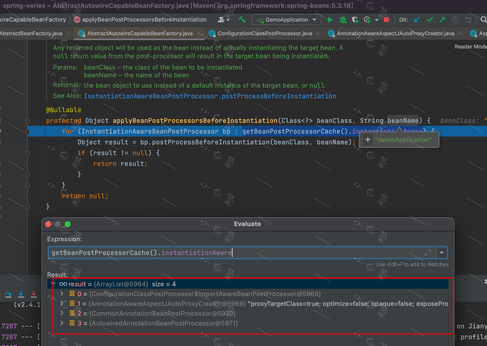

## 前言
>`AbstractAutowireCapableBeanFactory#createBean`这个方法可以说是最核心的方法，没有之一。
具体位置在`AbstractBeanFactory#doGetBean`的`return createBean(beanName, mbd, args);`

主要的步骤，以`demoApplication`为例

## resolveBeanClass
这里因为例子中的`demoApplication`是配置类，所以此前BeanClass已经由[ConfigurationClassPostProcessor](/md/source_code/spring/后置处理器/ConfigurationClassPostProcessor/ConfigurationClassPostProcessor.md)
设置成了CGLIB的代理对象。这一步最后返回了`BeanDefinition`的BeanClass。

## resolveBeforeInstantiation(beanName, mbdToUse)
这一步主要执行`InstantiationAwareBeanPostProcessor`的实例化Bean的拦截方法。

1. **applyBeanPostProcessorsBeforeInstantiation :** 执行`postProcessBeforeInstantiation`如图
   
   >通过观察可以发现，只有`AnnotationAwareAspectJAutoProxyCreator`实现了`InstantiationAwareBeanPostProcessor#postProcessBeforeInstantiation`，用于创建代理对象。
   其他三种都是默认`return null`。最终结果由于我们没有添加aop相关的拦截，所以`AnnotationAwareAspectJAutoProxyCreator`也返回了null。
2. 若上一步返回不为null，则**applyBeanPostProcessorsAfterInitialization :** 执行`postProcessAfterInitialization`

## doCreateBean
1. **createBeanInstance**
   1. `resolveBeanClass`这一步上面已讲过，不再赘述
   2. 推断构造方法：
      1. **determineConstructorsFromBeanPostProcessors(beanClass, beanName) :** 这一步需要通过`BeanPostProcessor`获取构造方法，主要涉及到`AutowiredAnnotationBeanPostProcessor`和`AnnotationAwareAspectJAutoProxyCreator`.
         * `AutowiredAnnotationBeanPostProcessor`返回null，因为`demoApplication`没有使用@Autowired注解注入
         * `AnnotationAwareAspectJAutoProxyCreator`没有实现
      2. **mbd.getPreferredConstructors() :** 因为`demoApplication`的BeanDefinition是`RootBeanDefinition`，所以这里返回null
      >以上两步，若能得到构造方法，则执行构造方法的注入`autowireConstructor`，否则执行3
      3. **instantiateBean(beanName, mbd) :** 使用无参构造方法创建实例。拿到`BeanDefinition`的`BeanClass`，通过`clazz.getDeclaredConstructor()`反射方式创建
   
2. **执行MergedBeanDefinitionPostProcessor :** 让后置处理器可以修改合并后的`BeanDefinition`
3. 循环依赖情况下，提前暴露一个BeanFactory
4. **populateBean :** 对创建的Bean进行属性填充。
   1. 执行后置处理器方法`InstantiationAwareBeanPostProcessors#postProcessAfterInstantiation`，可以对**实例化后的Bean**在**属性填充前**进行修改
   2. 判断注入方式是ByName则执行`autowireByName`，是ByType则执行`autowireByType`
   3. 执行`InstantiationAwareBeanPostProcessor`的`postProcessProperties`和`postProcessPropertyValues`
5. **initializeBean :** 初始化Bean
   1. **invokeAwareMethods :** 执行Aware方法，`BeanNameAware`｜`BeanClassLoaderAware`｜`BeanFactoryAware`
   2. 执行`BeanPostProcessor#postProcessBeforeInitialization`。
      这里的一个后置处理器`CommonAnnotationBeanPostProcessor`要重点关注，
      它的`postProcessBeforeInitialization`实际上是执行的父类`InitDestroyAnnotationBeanPostProcessor`方法，
      会执行`@PostConstruct`标注的初始化方法
   3. **invokeInitMethods :** 执行初始化方法，执行`InitializingBean#afterPropertiesSet`和指定的初始化方法
   4. 执行`BeanPostProcessor#postProcessAfterInitialization`
5. **registerDisposableBeanIfNecessary :** 注册销毁容器的Bean。如果要测试销毁容器，需要手动将context关闭。