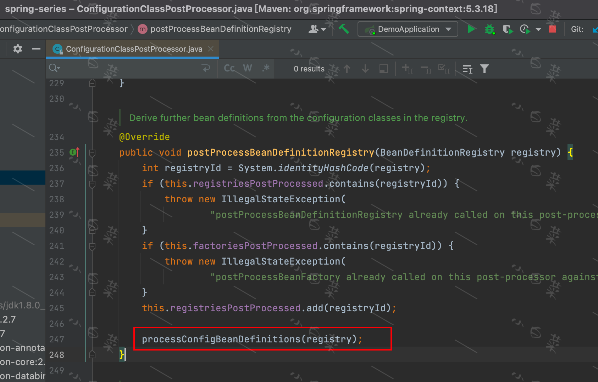

>顾名思义，这个后置处理器就是处理配置类的，比如它会先对配置类进行CGLIB的代理增强，提前将配置类实例化出来。 再基于这些配置类对象，将其他类也实例化出来。我们可以先看一下它的依赖关系。

## ConfigurationClassPostProcessor的依赖关系

我们可以从`ConfigurationClassPostProcessor`的依赖关系中， 知道它是一个`BeanDefinitionRegistryPostProcessor`(
即特殊的`BeanFactoryPostProcessor`)， 所以`postProcessBeanDefinitionRegistry`和`postProcessBeanFactory`这两个方法是我们重点关注的。

## BeanFactoryPostProcessor的执行时机

`BeanFactoryPostProcessor`的后置处理器，在`AbstractApplicationContext#invokeBeanFactoryPostProcessors`中执行。主要执行逻辑为：
1. 首先执行`BeanDefinitionRegistryPostProcessor`接口的`postProcessBeanDefinitionRegistry`方法，这个后置处理器用于注册`BeanDefinition`的(执行顺序是：优先执行实现了接口`PriorityOrdered`的，其次实现了`Ordered`的，最后其他的)
2. 再执行剩余的`BeanFactoryPostProcessor`接口的`postProcessBeanFactory`(执行顺序同上)

## postProcessBeanDefinitionRegistry

主要关注`processConfigBeanDefinitions(registry);`这个方法。

方法执行逻辑为：
1. 校验配置类并给这个类的`BeanDefinition`添加一个配置类标志`ConfigurationClassUtils.checkConfigurationClassCandidate(beanDef, this.metadataReaderFactory)`
2. 使用ConfigurationClassParser将配置类解析为ConfigurationClass对象
3. 调用`this.reader.loadBeanDefinitions(configClasses);`执行BeanDefinition的注册,
   `loadBeanDefinitions`主要注册了配置类自身及在配置类中@Bean的类

## postProcessBeanFactory
这个方法对`BeanDefinition`做了CGLIB增强。主要实现为`enhanceConfigurationClasses(beanFactory);`，大致步骤是：
1. 从`beanDefinitionMap`中筛选出，`BeanDefinition`属性中含有配置类标志的Bean。
    * 配置类标志(代码片段)：`if (ConfigurationClassUtils.CONFIGURATION_CLASS_FULL.equals(configClassAttr)) {...}`
    * 保存筛选结果(代码片段)：`configBeanDefs.put(beanName, (AbstractBeanDefinition) beanDef);`
2. 对筛选出来的配置类的`BeanDefinition`做CGLIB的代理增强
    * CGLIB代理增强(代码片段): `Class<?> enhancedClass = enhancer.enhance(configClass, this.beanClassLoader);`

