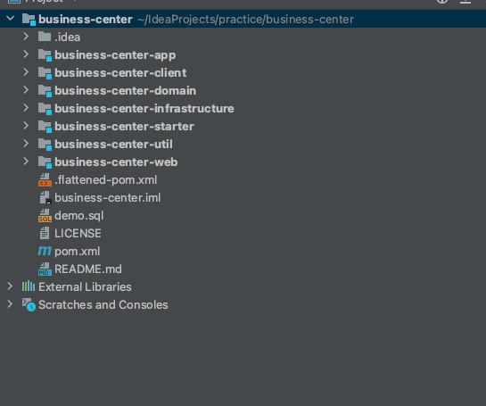
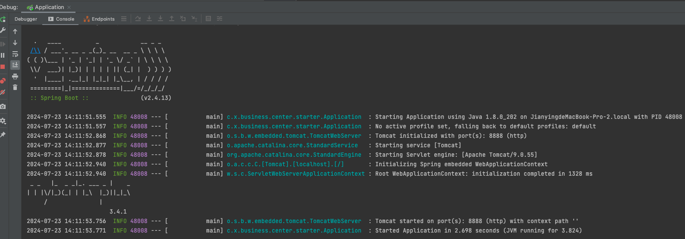

# 手把手教你使用Maven Archetype自定义代码脚手架

## 前言

新建项目时，项目的工程结构以及依赖的基础组件都是一样的。为此，我们为了避免重复造轮子，通常会有一套工程脚手架，用于快速搭建项目进行敏捷开发的同时，也可规范工程结构，使工程结构统一。

但同时，我们也希望我们用脚手架生成的工程，能满足以下要求：

1. `子module`命名能以工程名为前缀
   > 比如工程名称为`business-center`,则`子module`为`business-center-util`、`business-center-app`等等
2. `子module`相互之间能自动建立好依赖关系

**这样就需要我们自定义一套工程脚手架。**

> 搭建之前首先要有一个可运行的项目，可以使用本文的演示项目，欢迎大家fork和star。
>
>演示项目[springboot-project-archetype](https://github.com/caijianying/springboot-project-archetype)是基于DDD架构自定义的一个代码工程, 包含了基础的Mysql数据库和Mybatis-Plus配置。
>
>[](https://github.com/caijianying/springboot-project-archetype) [](https://github.com/caijianying/springboot-project-archetype)


话不多说，以下是详细的搭建过程😁

## 搭建

### 0. 开发环境

>1. JDK8
>2. Maven 3.8.1
>3. SpringBoot 2.4.13
>4. MyBatis-Plus 3.4.1

### 1. 安装maven脚手架插件

在项目的根目录的pom.xml中安装插件

```maven
   <build>
        <plugins>
            <plugin>
                <groupId>org.apache.maven.plugins</groupId>
                <artifactId>maven-archetype-plugin</artifactId>
                <version>3.0.1</version>
            </plugin>
            <plugin>
                <groupId>org.apache.maven.plugins</groupId>
                <artifactId>maven-compiler-plugin</artifactId>
                <version>3.8.1</version>
            </plugin>
        </plugins>
    </build>
```

### 2. 生成脚手架模板

点击`archetype:create-from-project`生成脚手架模板


### 3. 脚手架模板配置

#### 明确我们目标是生成什么样的项目

可以看到生成的脚手架模板是这样的，几乎跟原有项目一摸一样，这并不符合我们的要求。


由于大多数工程项目的module之间有依赖关系，当你指定`groupId`和`artifactId`后，对应的依赖也要发生变化，所以这里不能写死。

所以为了避免我们使用脚手架生成的工程出现一堆报错，有以下两个要求：

1. module名要根据父项目自动生成。比如 `business-center`，则原有的子module `demo-web` 会生成为`business-center-web`
2. 指定`groupId`和`artifactId`后, `pom.xml`中的依赖也应该与指定的一致

#### 为了满足以上2个要求，我们做如下修改

> 注意⚠️
>
>️我们配置模板的位置是target目录下的**`generated-sources/archetype/src/main/resources`**，可不要弄错了。

##### 1. 增加modules的信息

```maven
      <modules>
        <module>${rootArtifactId}-starter</module>
        <module>${rootArtifactId}-app</module>
        <module>${rootArtifactId}-web</module>
        <module>${rootArtifactId}-client</module>
        <module>${rootArtifactId}-infrastructure</module>
        <module>${rootArtifactId}-domain</module>
        <module>${rootArtifactId}-util</module>
      </modules>
```

* 同样的方式修改`dependencyManagement`的依赖，如

```maven
      <dependency>
         <groupId>com.xiaobaicai.demo</groupId>
         <artifactId>demo-util</artifactId>
         <version>${revision}</version>
      </dependency>
```

改为

```maven
      <dependency>
         <groupId>${groupId}</groupId>
         <artifactId>${rootArtifactId}-util</artifactId>
         <version>${revision}</version>
      </dependency>
```

##### 2. 同样的方式，修改子module的pom文件

##### 3. 修改module的名称，改为双下划线形式，如`__rootArtifactId__-client`

##### 4. 修改 `archetype-metadata`。位置在target目录下的`generated-sources/archetype/src/main/resources/META-INF/maven/archetype-metadata.xml`,命名方式跟上一步保持一致，注意id、dir、name的改法。如将

```xml

<module id="demo-infrastructure" dir="demo-infrastructure" name="demo-infrastructure">
```

改为

```xml

<module id="${rootArtifactId}-infrastructure" dir="__rootArtifactId__-infrastructure"
        name="${rootArtifactId}-infrastructure">
```

## 使用脚手架

> 注意⚠️
>
>我们将脚手架模板`mvn install`进本地仓库后，使用的`-DarchetypeArtifactId `会自动加上`-archetype`。 即原有`springboot-project-archetype`会变为`springboot-project-archetype-archetype`。 所以使用脚手架的时候，指定`-DarchetypeArtifactId `需要在原有基础上加上`-archetype`


执行maven命令

```shell
mvn archetype:generate -DgroupId=com.xiaobaicai.business.center -DartifactId=business-center -DrootArtifactId=business-center -Dversion=1.0.0 -DarchetypeGroupId=com.xiaobaicai.demo -DarchetypeArtifactId=springboot-project-archetype-archetype -DarchetypeVersion=1.0.0 -DinteractiveMode=false -DoutputDirectory=/yourDir/yourPath -e
```

* groupId: 生成工程的groupId
* artifactId、rootArtifactId: 生成工程的artifactId
* version：生成工程的version
* archetypeGroupId: 脚手架工程的groupId
* archetypeArtifactId: 脚手架工程的artifactId
* archetypeVersion: 脚手架工程的version
* interactiveMode: 是否需要交互，获得用户输入
* outputDirectory: 指定生成工程代码的路径
* -e: 若有错误，会打印错误堆栈

## 最后

可以看到最后生成的工程，是没有报错的，且可运行。






