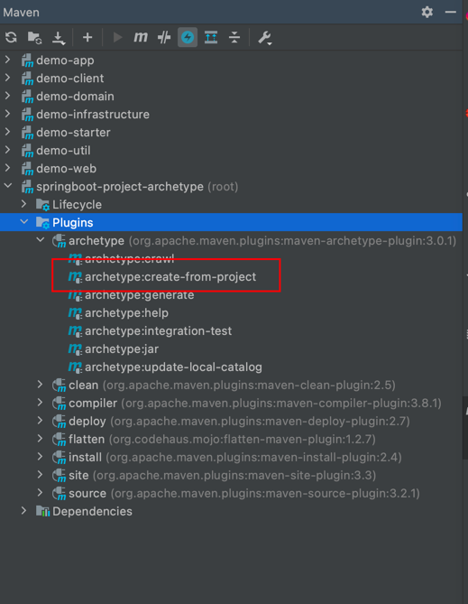
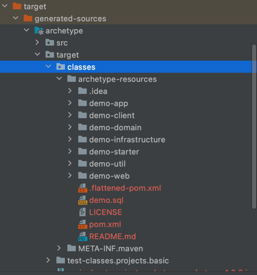
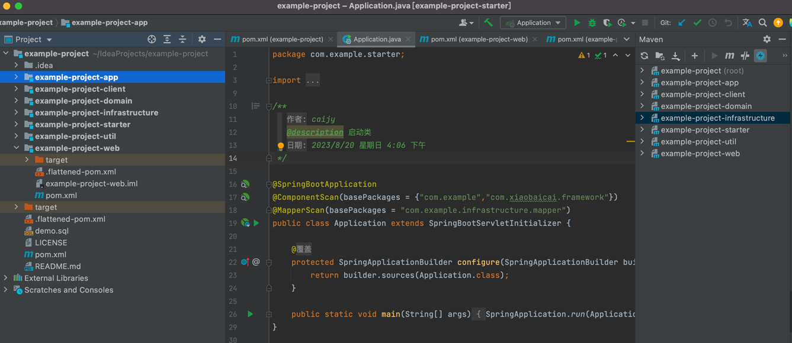

# 搭建和使用工程脚手架

## 前言

新建项目时，项目的工程结构以及依赖的基础组件都是一样的。为此，我们为了避免重复造轮子， 通常会有一套工程脚手架，用于快速搭建项目进行敏捷开发的同时， 也可规范工程结构，使工程结构统一。

发现网上很多关于脚手架的搭建和使用描述得比较粗糙和生硬，所以准备自己动手实践一次，记录详细的过程以及碰到的问题😁

接下来将告诉大家如何搭建和使用脚手架

## 搭建

>搭建之前首先要有一个可运行的项目，没有项目的可以使用演示项目，欢迎大家fork和star。
>
> 

演示项目[springboot-project-archetype](https://github.com/caijianying/springboot-project-archetype)是基于DDD架构自定义的一个脚手架, 包含了基础的Mysql数据库和Mybatis-Plus配置。

### 1. 安装maven脚手架插件

在项目的根目录的pom.xml中安装插件

    <build>
        <plugins>
            <plugin>
                <groupId>org.apache.maven.plugins</groupId>
                <artifactId>maven-archetype-plugin</artifactId>
                <version>3.0.1</version>
            </plugin>
            <plugin>
                <groupId>org.apache.maven.plugins</groupId>
                <artifactId>maven-compiler-plugin</artifactId>
                <version>3.8.1</version>
            </plugin>
        </plugins>
    </build>

### 2. 生成脚手架模板

点击`archetype:create-from-project`生成脚手架模板

### 3. 脚手架模板配置

#### 明确我们目标是生成什么样的项目

可以看到生成的脚手架模板是这样的，几乎跟原有项目一摸一样，这并不符合我们的要求。

由于大多数工程项目的module之间有依赖关系，当你指定`groupId`和`artifactId`后，对应的依赖也要发生变化，所以这里不能写死。

所以为了避免我们使用脚手架生成的工程出现一堆报错，有以下两个要求：

1. module名要根据父项目自动生成。比如 example-project，则原有的子module `demo-web` 会生成为`example-project-web`
2. 指定groupId和artifactId后, `pom.xml`中的依赖也应该与指定的一致

#### 为了满足以上2个要求，我们开始配置

注意⚠️ 我们配置模板的位置是target目录下的`generated-sources/archetype/target/classes/archetype-resources`，可不要弄错了。

1. 修改父pom

* 增加modules的信息

    <modules>
        <module>${rootArtifactId}-starter</module>
        <module>${rootArtifactId}-app</module>
        <module>${rootArtifactId}-web</module>
        <module>${rootArtifactId}-client</module>
        <module>${rootArtifactId}-infrastructure</module>
        <module>${rootArtifactId}-domain</module>
        <module>${rootArtifactId}-util</module>
    </modules>

* 同样的方式修改`dependencyManagement`的依赖，如

        <dependency>
            <groupId>com.xiaobaicai.demo</groupId>
            <artifactId>demo-util</artifactId>
            <version>${revision}</version>
        </dependency>

改为

        <dependency>
            <groupId>${groupId}</groupId>
            <artifactId>${rootArtifactId}-util</artifactId>
            <version>${revision}</version>
        </dependency>

2. 同样的方式，修改子module的pom文件
3. 修改module的名称，改为双下划线形式，如`__rootArtifactId__-client`
4. 修改 `archetype-metadata`
   位置在target目录下的`generated-sources/archetype/target/classes/META-INF/maven/archetype-metadata.xml`

命名方式跟上一步保持一致，注意id、dir、name的改法。如将
   
      <module id="demo-infrastructure" dir="demo-infrastructure" name="demo-infrastructure">

改为

      <module id="${rootArtifactId}-infrastructure" dir="__rootArtifactId__-infrastructure" name="${rootArtifactId}-infrastructure">

### 使用脚手架

>注意⚠️
> 
>我们将脚手架模板`mvn install`进本地仓库后，使用的`-DarchetypeArtifactId `会自动加上`-archetype`。
即原有`springboot-project-archetype`会变为`springboot-project-archetype-archetype`。
所以使用脚手架的时候，指定`-DarchetypeArtifactId `需要在原有基础上加上`-archetype`

执行maven命令

      mvn archetype:generate -DgroupId=com.example -DartifactId=example-project -DarchetypeGroupId=com.xiaobaicai.demo -DarchetypeArtifactId=springboot-project-archetype-archetype -DarchetypeVersion=1.0.0 -DinteractiveMode=false

可以看到最后生成的工程，是没有报错的，且可运行。

   

