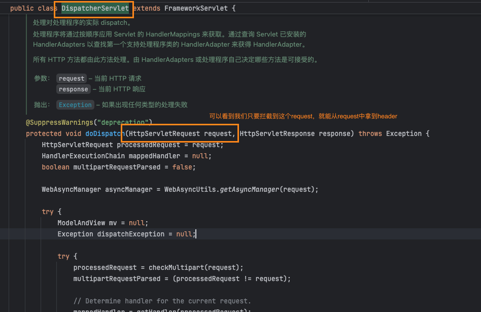

> 压测标的常见方案，是通过HTTP请求的Header中添加。
> 
> 如head头加上：highLight(pt-flag : pt)

那么熟悉SpringMVC的都知道，可以从`org.springframework.web.servlet.DispatcherServlet`的`doDispatch`拿到`HttpServletRequest`对象。



拿到`HttpServletRequest`对象，获取header头数据就简单了。

nice，那么开始撸代码！

## Agent

### 方法拦截，委托到拦截器
> highLight(premain)方法中编写拦截的类和方法
```java
AgentBuilder agentBuilder = new AgentBuilder.Default();

agentBuilder = agentBuilder
        .type(named("org.springframework.web.servlet.DispatcherServlet"))
        .transform((builder, typeDescription, classLoader, module) -> 
         builder.method(named("doDispatch"))
                .intercept(MethodDelegation.to(new DispatcherServletInterceptor()))
        );

agentBuilder.with(AgentBuilder.RedefinitionStrategy.RETRANSFORMATION).installOn(inst);
```
我们先拦截到`DispatcherServlet`的`doDispatch`方法，并委托到一个highLight(拦截器)执行。

### 拦截器DispatcherServletInterceptor
```java
public static class DispatcherServletInterceptor {
        @RuntimeType
        public Object intercept(@This Object obj, @Origin Class<?> clazz, 
                                @AllArguments Object[] allArguments, @Origin Method method, 
                                @SuperCall Callable<?> callable) throws Throwable {
            Object call = null;
            try {
                call = callable.call();
            } catch (Throwable ignored) {

            }
            return call;
        }
    }
```
* @This 当前的对象实例
* @Origin 当前的对象的class
* @@AllArguments 拦截方法的入参
* @Origin 原始引用，比如Method、Constructor、Executable等
* @SuperCall 拦截方法的Callable对象

具体可参考 `MethodDelegation`的注释.

#### HttpServletRequest

本例使用SpringBoot3，可以发现SpringBoot3中的`HttpServletRequest`全类名为`jakarta.servlet.http.HttpServletRequest`,
而在SpringBoot2中为`javax.servlet.http.HttpServletRequest`。`HttpServletRequest`只是换了包而已，获取header的方法并没变。

那么我们可以做以下操作拿到header头，原理是通过反射执行`getHeader`方法。

本例中规定`pt-flag`header头的值为`pt`,若为`pt`则说明是压测流量，反之为业务流量。
```java
for (Object allArgument : allArguments) {
    String headerValue = null;
    boolean match = Arrays.stream(allArgument.getClass().getInterfaces()).anyMatch(t -> "jakarta.servlet.http.HttpServletRequest".equals(t.getName()));
    if (match) {
        Method getHeader = allArgument.getClass().getDeclaredMethod("getHeader", String.class);
        getHeader.setAccessible(true);
        Object invoke = getHeader.invoke(allArgument, "pt-flag");
        headerValue = invoke == null ? null : invoke.toString();
        System.out.println(headerValue);
    }
}
```
到这一步我们已经拿到压测标了，但是还需要将压测标存储起来，用于后面判断highLight(是否需要写入压测流量)

这里利用ThreadLocal实现了上下文管理器，可查看[Step2: 压测标透传](/stress_testing_agent/md/stress_flag_transfer.md)


## 保存压测标

> 保存压测标，用于后续压测流量判断

```java
if(headerValue!=null){
    ContextManager.setProperty(StressTestingConstant.HEADER_NAME_STRESS_TESTING_FLAG,StressTestingConstant.HEADER_VALUE_STRESS_TESTING_FLAG.equals(headerValue));
}
```

## 完整例子

```java
/**
 * @author xiaobaicai
 * @description 关注微信公众号【程序员小白菜】领取源码
 * @date 2024/12/4 星期三 15:09
 */
public class StressTestingAppAgent {

    public static void premain(String agentArgs, Instrumentation inst) {

        AgentBuilder agentBuilder = new AgentBuilder.Default();

        agentBuilder = agentBuilder.type(named("org.springframework.web.servlet.DispatcherServlet")).transform((builder, typeDescription, classLoader, module) -> builder.method(named("doDispatch")).intercept(MethodDelegation.to(new DispatcherServletInterceptor())));

        agentBuilder.with(AgentBuilder.RedefinitionStrategy.RETRANSFORMATION).installOn(inst);
    }


    public static void agentmain(String agentArgs, Instrumentation inst) {

    }


    public static class DispatcherServletInterceptor {

        @RuntimeType
        public Object intercept(@This Object obj, @Origin Class<?> clazz, @AllArguments Object[] allArguments, @Origin Method method, @SuperCall Callable<?> callable) throws Throwable {

            for (Object allArgument : allArguments) {
                String headerValue = null;
                boolean match = Arrays.stream(allArgument.getClass().getInterfaces()).anyMatch(t -> "jakarta.servlet.http.HttpServletRequest".equals(t.getName()));
                if (match) {
                    Method getHeader = allArgument.getClass().getDeclaredMethod("getHeader", String.class);
                    getHeader.setAccessible(true);
                    Object invoke = getHeader.invoke(allArgument, "pt-flag");
                    headerValue = invoke == null ? null : invoke.toString();
                    System.out.println(headerValue);
                }

                if (headerValue != null) {
                    ContextManager.setProperty(StressTestingConstant.HEADER_NAME_STRESS_TESTING_FLAG, StressTestingConstant.HEADER_VALUE_STRESS_TESTING_FLAG.equals(headerValue));
                }
            }
            Object call = null;
            try {
                call = callable.call();
            } catch (Throwable ignored) {

            }
            return call;
        }
    }
}
```


## 相关资料

* [ByteBuddy官网](https://github.com/raphw/byte-buddy)

