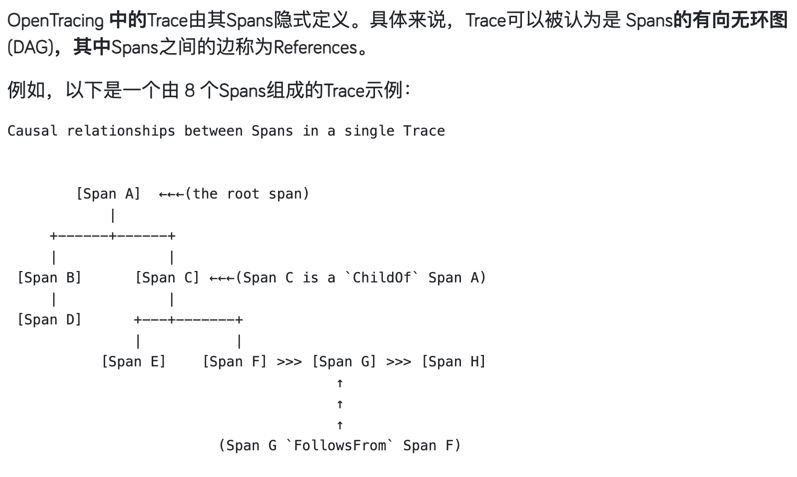

## OpenTracing
> 提到链路监控，就不得不提到`OpenTracing`
>
`OpenTracing`是一套跨系统跨语言的分布式追踪语义规范，有三种关键且相互关联的类型：`Trace`、`Span`、`SpanContext`。

* `Trace`是一个隐式概念，笔者认为描述的应该是能表示调用链的由多个`Span`和highLight(引用)构成的数据结构

* `Span`: 笔者把它通俗地理解为，一个`Span`就是一次方法的调用或者一次中间件(比如RPC、MQ等)的调用

* `SpanContext`: 方法调用链路的上下文




`OpenTracing`定义的2种引用关系
* ChildOf: 如图，SpanC is ChildOf SpanA
* FollowsFrom: 如图，SpanG is FollowsFrom SpanF

## 实现链路监控
先从**链路**和**监控**两个方面来说明，该怎么实现。
* 链路
  回顾一下我们写的拦截器的作用：
  * `DispatcherServletInterceptor`：拦截执行的HTTP请求
  * `BoundSqlInterceptor`：获取执行的sql
  * `DefaultSqlSessionFactoryInterceptor`：获取数据库配置
  以上只有`DispatcherServletInterceptor`可以支持链路的耗时。
  
  现在只有HTTP这一条调用链路，还需增加`Service层`调用链路和`SQL层`调用链路。`Service层`调用链路，可以通过监控Spring注解`@Service`标记的服务调用实现。SQL层调用链路，可以通过监控`ClientPreparedStatementInterceptor#execute`实现。

* 监控
  
  可监控的指标有很多，比如highLight(CPU使用率)、highLight(内存占用情况)、highLight(方法调用耗时)等，我们监控的是highLight(方法调用耗时)。

### 支持Spring注解@Service
* 委托拦截器
```java
    agentBuilder = agentBuilder.type(isAnnotatedWith(named("org.springframework.stereotype.Service")))
        .transform((builder, typeDescription, classLoader, module) -> 
            builder.method(isPublic().and(not(named("getBaseMapper"))))
            .intercept(MethodDelegation.to(new ServiceAnnotationInterceptor())));
```
* ServiceAnnotationInterceptor拦截器
```java
    public static class ServiceAnnotationInterceptor {
        @RuntimeType
        public Object intercept(@This Object obj, @Origin Class<?> clazz, @AllArguments Object[] allArguments, @Origin Method method, @SuperCall Callable<?> callable) {
            Object call = null;
            try {
                call = callable.call();
            } catch (Throwable ignored) {
    
            }
            return call;
        }
    }
```

### 支持SQL层调用耗时
* 委托拦截器
```java
    agentBuilder = agentBuilder.type(named("com.mysql.cj.jdbc.ClientPreparedStatement"))
        .transform((builder, typeDescription, classLoader, module) -> 
            builder.method(named("execute"))
            .intercept(MethodDelegation.to(new ClientPreparedStatementInterceptor())));
```
* ClientPreparedStatementInterceptor拦截器
```java
public static class ClientPreparedStatementInterceptor {
      @RuntimeType
      public Object intercept(@This Object obj, @Origin Class<?> clazz, @AllArguments Object[] allArguments, @Origin Method method, @SuperCall Callable<?> callable) {
          String preparedSql = null;
          try {
              if (obj instanceof ClientPreparedStatement) {
                  ClientPreparedStatement stmt = (ClientPreparedStatement) obj;
                  preparedSql = stmt.getPreparedSql();
              }

          } catch (Throwable ignored) {

          }

          ContextManager.createSpan(method.getName() + " Execute SQL. " + (preparedSql == null ? "" : preparedSql));
          Object call = null;
          try {
              call = callable.call();
          } catch (Throwable ignored) {

          }

          ContextManager.finishSpan();
          return call;
      }
  }
```

### 梳理调用链路
> 按照OpenTracing规范，我们接下来需要定义`Span`的数据结构，再根据`Span`及`Span`的引用关系，把调用链路打印出来

#### LocalSpan
> LocalSpan的作用是保存每个Span的基本信息，
> * 涉及到数据统计的字段：开始时间、耗时(ms)、链路名称
> * 涉及到上下文的字段：TraceId
> * 涉及到Span引用关系的字段：SpanId、ParentSpanId
> * 是否为父节点的判断字段：isRoot
>
```java
    @AllArgsConstructor
    @NoArgsConstructor
    @Builder
    @Data
    public class LocalSpan implements Serializable {
        @Serial
        private static final long serialVersionUID = -7335003348952891472L;
    
        private boolean isRoot;
        
        private String traceId;
        
        private String spanId;
        
        private String parentSpanId;
        
        /**
         * 链路名称
         **/
        private String operateName;
    
        private Long startTime;
        
        private Long costTime;
    
        public void start() {
            this.startTime = System.currentTimeMillis();
        }

        public void finish() {
            this.costTime = System.currentTimeMillis() - startTime;
        }
    }
```
 
#### 保存调用链路
> 梳理链路的第一步是保存各自的链路，再根据`LocalSpan`中的`spanId`和`parentSpanId`来确定`LocalSpan`的引用关系

其实在方法调用前，我们就能得到LocalSpan的大部分信息，方法调用后只需要记录耗时就行了。

那么我们大致做法就出来了。

        createSpan => 方法调用 => finishSpan

##### 改造拦截器
我们可以改造一下拦截器，`ServiceAnnotationInterceptor`为例
```java
public static class ServiceAnnotationInterceptor {

      @RuntimeType
      public Object intercept(@This Object obj, @Origin Class<?> clazz, @AllArguments Object[] allArguments, @Origin Method method, @SuperCall Callable<?> callable) {
          ContextManager.createSpan(obj.getClass().getName() + "." + method.getName());
          Object call = null;
          try {
              call = callable.call();
          } catch (Throwable ignored) {
  
          }
          ContextManager.finishSpan();
          return call;
      }
}
```
其实就加了highLight(两行)代码.


##### createSpan 参数设置如下

```java
public static void createSpan(String operateName) {
        boolean root = isRoot();
        if (root) {
            init();
        }
        String spanId = UUID.randomUUID().toString();
        LocalSpan localSpan = LocalSpan.builder()
                .isRoot(root)
                .traceId(getGlobalTraceId())
                .spanId(spanId)
                .parentSpanId(getParentSpanId())
                .operateName(operateName)
                .build();
        register(localSpan);
        localSpan.start();
    }
```

* **isRoot**：判断全局`TraceId`是否存在，不存在则为true
* **traceId**：通过`ThreadLocal`获取, 获取不到则创建并存入`ThreadLocal`
* **spanId**：每个`LocalSpan`的唯一标识
* **parentSpanId**：从highLight(调用栈)中获取上一个`LocalSpan`。这里使用`LinkedList`执行栈的基本操作。
* **operateName**：链路名称，从拦截器传入
* **startTime**： 方法调用开始时间
* **costTime**：耗时，执行`LocalSpan#finish`方法后方才有值

highLight(register方法，其实就是对当前的Span进行入栈操作并缓存起来)

以上其他部分方法是简单的封装，就不再赘述。


##### finishSpan
> 想想`finishSpan`应该做什么事情，仅仅是`LocalSpan#finish`吗
> 
> 比如还有highLight(方法的出栈)操作、请求完成后的highLight(trace链路显示)和highLight(资源释放)操作

```java
    public static void finishSpan() {
        // 获取将要出栈的Span
        LinkedList<String> methodStack = LOCAL_SPAN_ID_STACK.get();
        String spanId = methodStack.peekLast();
        LocalSpan localSpan = LOCAL_SPAN_CACHE.get().get(spanId);
        // 耗时记录
        localSpan.finish();
        // 出栈
        methodStack.removeLast();

        if (methodStack.isEmpty()) {
            // 打印trace链路
            printTraceInformation();
            // 释放资源
            remove();
        }
    }
```

这里提一下两个方法：
* `printTraceInformation()`：trace链路是根据链路的深度进行打印的，具体可看项目源码
* `remove()`：释放资源，即对ThreadLocal进行Remove操作

##  相关资料
* [OpenTracing 语义规范](https://opentracing.io/specification)
* [opentracing（开放分布式追踪） + jaeger初探](https://developer.aliyun.com/article/1279595)